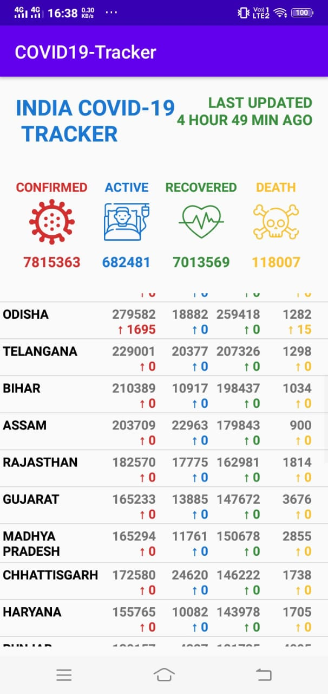
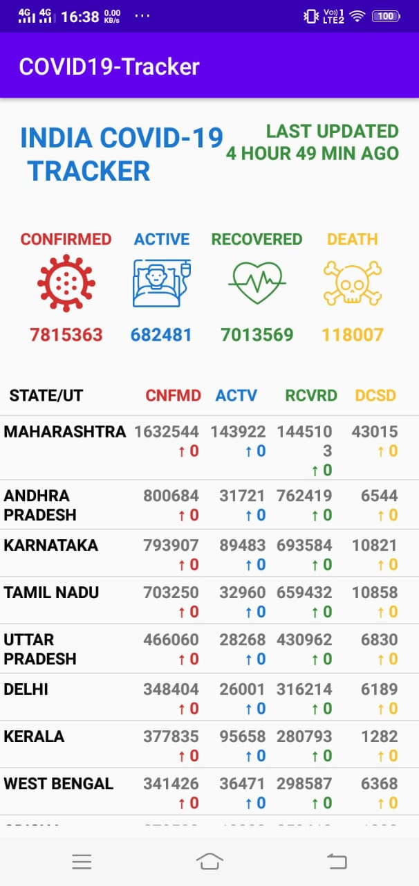

# COVID-19 TRACKER APP

## ABOUT:
- An APP which in a single place, shows all information related to COVID-19 INDIA.  
- All the information has been accessed in real-time form Government websites.
- All statewise data regarding: Confirmed Cases, Active Cases, Recovered, Deceased has been shown in the app.
- API used: https://api.covid19india.org/data.json

## APP IMAGES:

        

## Add Project to Desktop:
1) Open Android Studio App.
2) Follow the steps: File > New > Project from Version Control..
3) In the Box that appears:

    i) Select Version Control as Git from the drop down menu.
    
    ii) In the Url box, paste this url: https://github.com/souvikcode/COVID19-Tracker-Latest.git .
    
    iii) In the directory, browse the directory where you want.
    
    iv) Select Clone.
    

## How to use the app:
  Just open the App, and its ready to use, locate your state from the list.
  
## Motivation to build:
   Wanted a single place information centre for all COVID-19 INDIA information.
   
## Contribution:
   Contribution by making pull request are all always welcome. 
